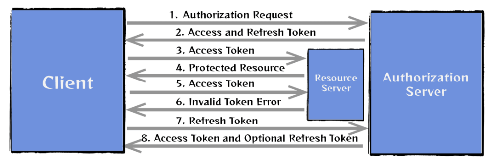

# Spring Security with JWT Implementation

In this project I tried to provide the implementation of jwt token as simple as it could be.
All the needed requests you can find here
https://www.postman.com/martian-meadow-737952/workspace/jwt/collection/27254100-0c6a5d5f-84c7-47ce-8f9f-99d035afec2e?action=share&creator=27254100

## Access and Refresh Tokens: Theory

### Access Token
is a short-lived token that is issued by an authentication server, used primarily to authorize API
requests made by a client. It contains information (or claims) about the user. The token is sent in the
HTTP header to access protected resources. Because of its limited lifetime, which typically lasts from several minutes
to hours, it helps reduce the risk of access token theft.

### Refresh Token
is a long-lived token used to renew access tokens when they expire. This token is stored securely on the
client and sent to the authentication server to obtain a new access token when needed. This process helps avoid asking
the user to log in frequently.

## Single session for one user
In a typical single session (one device for one user), the flow is as follows:

Stealing tokens(and information at all) is not easy if you use HTTPS, but still. Let's see some cases:
* If hacker somehow manages to steal an access-token, he will be able to do his dirty thing for a short time. 
* If hacker somehow manages to steal a refresh-token, the session of the real user will be invalidated.
  He will need re-authentication, and after that the session of the hacker will be gone.

## Multiple-session for one user
IN PROGRESS...
